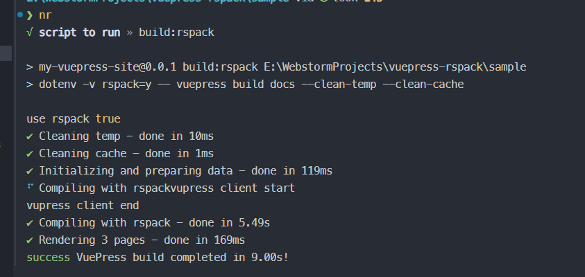
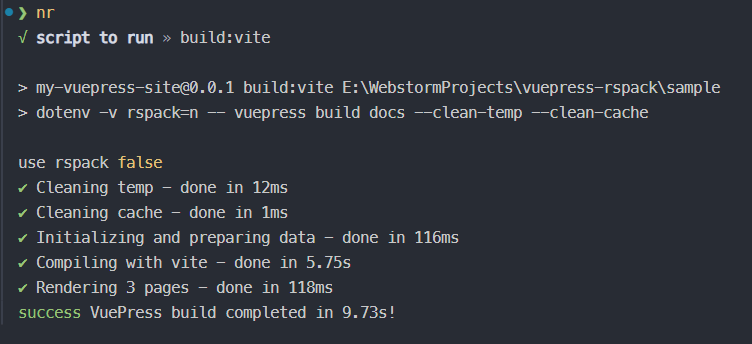

# bundler-rspack

## run

folder structure

```
bundler-rspack -   rspack bundler source
sample         -   a vuepress sample created by create-vuepress

```

1. install deps

```shell
pnpm install 
```

2. build bundler-rspack

```shell
cd bundler-rspack

pnpm build
```

3. build docs

```shell
# run with rspack
pnpm dev:rspack  
# run with vite
pnpm dev:vite
# build with rspack
pnpm build:rspack
# build with vite
pnpm build:vite


```

compare rspack and vite compile speed

## rspack



## vite


